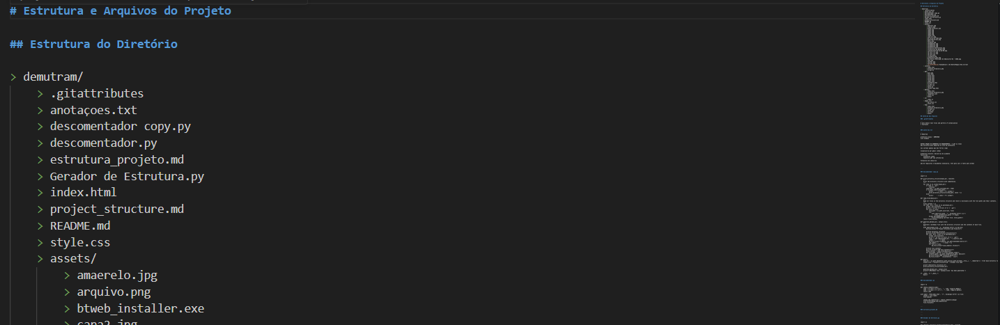

# Gerador de Estrutura de Projeto Markdown

## Funcionalidades

- Imprime a estrutura do diretório
- Lê todos os arquivos na estrutura de diretórios
- Gera um arquivo com a estrutura e os conteúdos

## Python 3.6 ou superior.

## Como Usar

1. Clone este repositório:

2. altere o diretorio, esta vazio por padrão `../`

3. Execute o script:

4. O arquivo `estrutura_projeto.md` será gerado no diretório atual contendo a estrutura do projeto e os conteúdos dos arquivos

